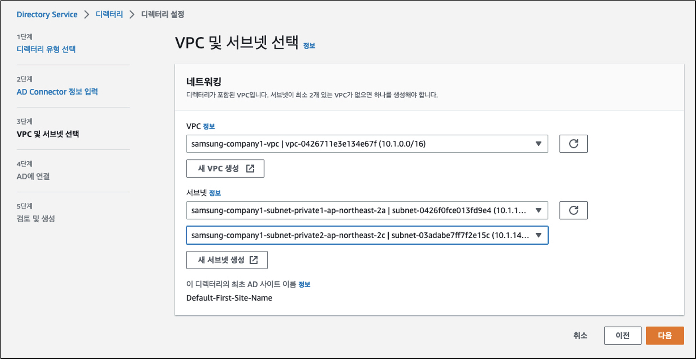

# [컨트롤타워와 온프레미스 인프라 연동 - Federated Authentication]()

## [컨트롤 타워 측 네트워크 준비 Quick Guide]()

이 문서에서는 온프레미스에 구축된 Identity Store인 Active Directory와 연동하여 인증을 처리한 후 AWS 콘솔에 접근할 수 있도록 하기 위한 과정 중 클라우드 측에 필요한 준비 과정을 설명합니다. 

실제로 온프레미스와 연계하기 위해서는 Direct Connect (DX) 혹은 Site-to-Site (S2S) VPN과 같은 물리적인 인프라 구축이 선행되어야 하지만, 이에 대한 실습은 이후로 미루고 여기에서는 온프레미스를 시뮬레이션하는 AWS 클라우드와 컨트롤 타워의 Management Console을 Transit Gateway로 연결하는 과정을 수행할 수 있도록 하는 것이 목적입니다.

즉, 온프레미스 목적의 AWS 어카운트와 컨트롤 타워의 Management 어카운트를 AWS 클라우드 요소를 사용하여 네트워크 체결을 하겠지만, 이를 DX나 S2S VPN 연결을 통한 연계로 가정해 주시기 바랍니다.

전체적인 아키텍처는 다음과 같습니다. 

1. (온프레미스) 임직원 정보를 저장하는 Active Directory를 생성하고 구성하여야 합니다. 이 작업은 강사에 의해 사전에 진행될 것입니다.
2. (컨트롤 타워 - Management Account) 온프레미스의 임직원 서버에 접근하기 위하여 네트워크 구성을 하여야 합니다.
   1. **(중요)** *아래 목록에서 자신에게 부여된 번호를 사용하여 "10.NN.0.0/16"으로 CIDR 대역을 설정힙니다.*  예를 들어 이슬기 프로님의 경우 18번이므로 "10.18.0.0/16"으로 VPC CIDR 를 설정합니다. 
    또한 VPC 이름도 유사하게 설정합니다. 예) "samsung-company18"
         
   2. VPC: Active Directory (AD) Connector (아래 설명)가 위치할 VPC를 생성합니다. 
      
   2. 온프레미스로부터 공유된 Transit Gateway Sharing 수락하고 Transit Gateway Attachment를 생성합니다. 
       
       
       
   3. VPC 라우트 테이블에 온프레미스로부터 들고나는 라우트 경로를 추가합니다. 
       
       
   4. AD Connector 생성
      1. AD Connector는 Identity Portal을 통한 인증 요청을 온프레미스 Active Directory로 연계(Relay)해주는 서비스입니다. 생성되고 나면 Identity Center에서 Active Directory Identity Source로 인식되며 사용자 Provisioning 및 인증을 수행해 주는 통로가 됩니다. 
       
       
       
       
       
       
3. 이후부터는 강사가 제공한 가이드 문서를 참고하여 진행할 수 있습니다.
